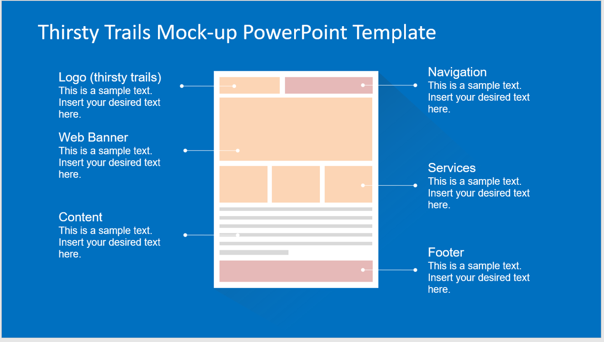

# class-pro-1

Thirsty Trails

participants:
Kamy Leeret
Skip Khamvongsa
Tammy Richardson

APIs we intend to use:
1.) Hiker Project Data API: https://www.hikingproject.com/data
2.) Beer mapping API: https://www.programmableweb.com/api/beer-mapping

Our Vision
We want to create an app that will allow the user to search for local hiking trails and breweries/restraunts to visit after the hike. 

features:
search trails
condition data
campsites
weather
directions
difficulty level
breweries 
(pull city name into api to provide breweries near the trail 
with in a designated radius)
